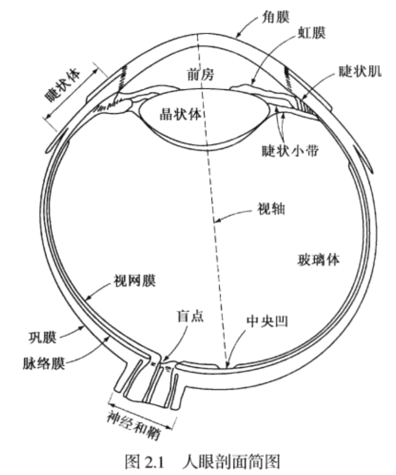
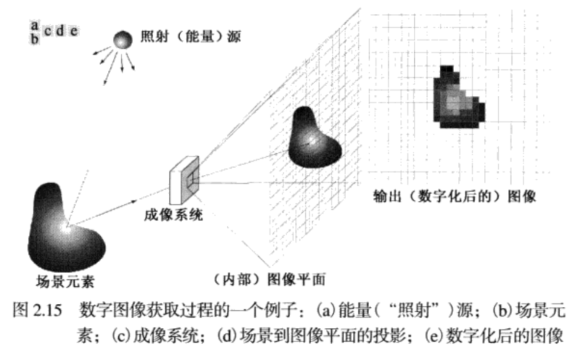
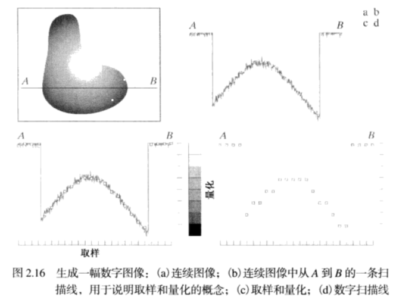

# Chapter2 数字图像基础
眼睛最里面的膜是：**视网膜**，布满了整个后部的 **内壁**，当外部物体的光在视网膜上成像。由视网膜表面分布 **不连续的光感受器** 提供图案视觉，有两类光感受器：**锥状体** 和 **杆状体**，锥状体在眼睛中有600~700万，位于视网膜的中间部分，称之为 **中央凹**，对颜色高度敏感。用这些 锥状体，人可以充分地分辨图像细节，因为每个 锥状体都连接到自身的神经末梢，肌肉控制眼球转动，直到有感兴趣的物体图像落到 中央凹，锥状体视觉称为 白昼视觉或亮视觉。

**杆状体**有 7500~15000万个分布在视网膜表面，由于分布面积较大而且几个杆状体连接到一个神经末梢，因此减少了这些感受器感知细节的数量。杆状体用来给出视野内的 **一般的总体图像**，它们没有彩色感觉，而对低照明度敏感，例如，在白天呈现鲜明色彩的物体，在月光下都没有颜色，因为此时只有 杆状体受到了刺激，这种现象称为 **暗视觉**。

有三个基本量用于描述彩色光源的质量：**发光强度**，**光通量**，**亮度**。**发光强度**是从光源流出能量的总量，通常用瓦特(W)来度量。流明数(lm)度量的光通量给出观察者从光源感受到的能量。

## 2.1 简单的图像形成模型
我们用形如 $f(x,y)$的二维函数来表示图像，在空间坐标$(x,y)$处，$f的值或者幅度是一个正的标量。

函数 $f(x,y)$ 由两个分量来表征，
(1)入射到被观察场景的光源照射总量；--**入射分量** $i(x,y)$
(2)场景中物体所反射的光照总量--**反射分量** $r(x,y)$
$$
f(x, y)=i(x, y) r(x, y)
$$
其中：
$$
0<i(x, y)<\infty
$$
$$
0<r(x, y)<1
$$
反射分量限制在0(全吸收)和1(全反射)之间，

## 2.2 取样和量化

一幅图像的x和y坐标及幅度可能都是连续的，为了将它转化为 **数字形式**，对 坐标值进行数字化称为 **取样**，对幅值数字化称为 **量化**。
图像由256个可能的离散灰度值的图像称之为8 **比特图像**。

## 2.3 空间和灰度分辨率
每单位距离点数是印刷和出版业中常用的图像分辨率的度量，通常用 **每英寸点数**(dpi)来表示。

## 2.4 图像内插
**内插** 是在诸如放大、收缩、旋转、和 几何校正等任务中广泛应用的而基本工具，这是基本的图像 **重取样方法**。
从根本上看，**内插** 是用已知数据来估计未知位置的数值的处理。
* 最近邻内插法：
  将原图中最近邻的灰度赋给了每个新位置，但是在某些直边缘会严重的失真。

* 双线性内插：
  用4个最近邻去估计给定位置的灰度。
$$
v(x, y)=a x+b y+c x y+d
$$

* 双三次内插：
  包括了16个最近邻点。在保持细节方面比双线性内插相对要好。
    $$
v(x, y)=\sum_{i=0}^{3} \sum_{j=0}^{3} a_{i j} x^{i} y^{j}
    $$

## 2.5 像素之间的关系
* 4邻域，用 $N_4(p)$来表示，
* 8邻域，用 $N_8(p)$来表示。

## 2.5  傅里叶变换对
### 2.5.1 周期函数的傅里叶展开 
函数$f(x)$以2l为 **周期**，即：
$$
f(x+2 l)=f(x)
$$
$f(x)$为光滑或分段光滑函数，且定义域为$[-l,l]$,则可取三角函数族
$$
1, \quad \cos \frac{\pi x}{l}, \quad \cos \frac{2 \pi x}{l}, \ldots, \quad \cos \frac{k \pi x}{l}, \ldots
$$
$$
0, \quad \sin \frac{\pi x}{l}, \quad \sin \frac{2 \pi x}{l}, \ldots, \quad \sin \frac{k \pi x}{l}, \ldots
$$
作为 **基本函数族**。将$f(x)$展开为 **傅里叶级数**。
$$
f(x)=a_{0}+\sum_{k=1}^{\infty}\left(a_{k} \cos \frac{k \pi x}{l}+b_{k} \sin \frac{k \pi x}{l}\right)
$$
称为周期函数$f(x)$的 **傅里叶级数展开式**，其中展开的系数称为 **傅里叶系数**。
函数族是 **正交的**，即为 **其中任意两个函数的乘积在一个周期上的积分等于零**。即：
$$
\int_{-l}^{l} 1 \cdot \cos \frac{k \pi x}{l} \mathrm{d} x=0 \quad(k \neq 0)
$$
$$
\int_{-l}^{l} 1 \cdot \sin \frac{k \pi x}{l} \mathrm{d} x=0
$$
$$
\int_{-l}^{l} \cos \frac{k \pi x}{l} \cdot \cos \frac{n \pi x}{l} \mathrm{d} x=0 \quad(k \neq n)
$$
$$
\int_{-l}^{l} \sin \frac{k \pi x}{l} \cdot \sin \frac{n \pi x}{l} \mathrm{d} x=0 \quad(k \neq n)
$$
$$
\int_{-l}^{l} \cos \frac{k \pi x}{l} \cdot \sin \frac{n \pi x}{l} \mathrm{d} x=0
$$
利用三角函数的正交性，可以求得 **展开系数是**：
$$
f(x)=a_{0}+\sum_{k=1}^{\infty}\left(a_{k} \cos \frac{k \pi x}{l}+b_{k} \sin \frac{k \pi x}{l}\right)
$$
求这三个系数时，要两边一起积分得到 $a_0$,或则两边同时乘 $\cos \left(\frac{k \pi x}{l}\right)$ 再积分。
$$
a_{0}=\frac{1}{2 l} \int_{-l}^{l} f(x) \mathrm{d} x
$$
$$
a_{k}=\frac{1}{l} \int_{-l}^{l} f(x) \cos \left(\frac{k \pi x}{l}\right) \mathrm{d} x
$$
$$
b_{k}=\frac{1}{l} \int_{-l}^{l} f(x) \sin \left(\frac{k \pi x}{l}\right) \mathrm{d} x
$$

### 2.5.2 为何我们要用正弦曲线来代替原来的曲线？
* 可行性
  在时间区间$(t_1,t_2)$内，用$c_1f_1(t)$近似任意函数$f(t)$，并使 **误差**尽可能小。
  误差： 
$$
\varepsilon(t)=f(t)-c_{1} f_{1}(t)
$$

如何衡量函数误差的大小？
可以采用方均误差：
$$
\overline{\varepsilon^{2}(t)}=\frac{1}{t_{2}-t_{1}} \int_{t_{1}}^{t_{2}} \varepsilon^{2}(t) d t
$$

$c_1$取什么值的时候何时误差最小？或者何时系数最佳？
$$
\overline{\varepsilon^{2}(t)}=\frac{1}{t_{2}-t_{1}} \int_{t_{1}}^{t_{2}} \varepsilon^{2}(t) d t
=\frac{1}{t_{2}-t_{1}} \int_{t_1}^{t_{2}}\left[f(t)-c_{1} f_{1}(t)\right]^{2} d t
\\
=\frac{1}{t_{2}-t_{1}}\left[\int_{i_{1}}^{t_{2}} f^{2}(t) d t-2 c_{1} \int_{j_{1}}^{t_{2}} f(t) f_{1}(t) d t+c_{1}^{2} \int_{t_{1}}^{t_{2}} f_{1}^{2}(t) d t\right]
$$
为了求使 $\overline{\varepsilon^{2}(t)}$最小的 $c_1$,将上式对$c_1$求偏导并令其为零，可以得到：
$$\underset{\partial c_{1}}{\partial} \overline{\varepsilon^{2}(t)}=\frac{1}{t_{2}-t_{1}}\left[-2 \int_{t_{1}}^{t_{2}} f(t) f_{1}(t) d t+2 c_{1} \int_{t_{1}}^{t_{2}} f_{1}^{2}(t) d t\right]=0$$
$$
c_{1}=\frac{\int_{t_{1}}^{t_{2}} f(t) f_{1}(t) d t}{\int_{t_{1}}^{t_{2}} f_{1}(t) f_{1}(t) d t}
$$

### 2.5.3 如何用正弦曲线代替原来的曲线？
从现代的数学眼光来看，傅里叶变换是一种 **特殊的积分变换**，它能将满足一定条件的某个函数表示成正弦基函数的线性组合或者积分。

* 正交基观点
  任何一个n维向量都可以由n维正交基的线性组合确定。那么，一组正交函数的线性组合可以唯一确定一个函数。
  
如果集合$\left\{\psi_{0}, \psi_{1}, \psi_{2}, \ldots, \psi_{N}\right\}$中各个函数满足：

正交性：
$$
\int_{t_{1}}^{t_{2}} \psi_{n}(t) \psi_{m}^{*}(t) d t=\left\{\begin{array}{ll}{0} & {n \neq m} \\ {k} & {n=m}\end{array}\right.
$$
则$\left\{\psi_{n}(t)\right\}$为正交函数集。

完备性：可以不失真地组合出任意函数

1. 正交性，用一系列基：
$$
\vec{e}_{i} \cdot \vec{e}_{j}=\left\{\begin{array}{ll}{1} & {i=j} \\ {0} & {i \neq j}\end{array}\right.
$$

2. 完备性：偶函数不能拆解为$sin(nx)$奇函数
3. 定义点乘： 
$$
\vec{a} \cdot \vec{b}=|a| \cdot|b| \cdot \cos \theta=a_{x} b_{x}+a_{y} b_{y}+a_{z} b_{z}
$$
经过很多尝试，傅里叶给出 $f(x)$,$g(x)$在$[- \pi,\pi]$上定义，其乘积为 
$$
<f(x) \cdot g(x)>\equiv \int_{-\pi}^{\pi} f(x) g(x) d x
$$

4. 验证：
**正交性：**
$$
\int_{-\pi}^{\pi} \sin x \cdot \sin 3 x d x=\int_{-\pi}^{\pi} \frac{(-\cos4x+\cos 2 x)}{2} d x=0
$$
$$
\int_{-\pi}^{\pi} \sin nx \cdot \sin mx d x=\int_{-\pi}^{\pi} \frac{(-\cos(n+m)x +\cos(n-m)x)}{2} d x=0, n,m \in N
$$
当 $n \neq m, <\sin n x \cdot \sin m x>=0$

当$n=m ， \int_{-\pi}^{\pi} \frac{1}{2} d x=\pi$
类似向量积，正交性满足。

**完备性** ：
$f(x)=奇函数+偶函数=\frac{f(x) - f(-x)}{2} + \frac{f(x)+f(-x)}{2} = sinnx+cosnx$

由于$\sin (n_1x),\cos (n_2x)$可表示任意以 $2\pi$为周期的函数，但是$2\pi$内其均值为零，不能表示偏离原点的函数，则增加一个常量函数 $f(n)=1$

傅里叶级数：
$$
\begin{aligned} f(x)=\frac{1}{2} a_{0} &+a_{1} \cos x+a_{2} \cos 2 x+a_{3} \cos 3 x+\cdots(偶函数) \\ &+b_{1} \sin x+b_{2} \sin 2 x+b_3 \sin 3 x+\cdots(奇函数) \end{aligned}
$$
常值函数为偶函数，所以用$a_0$，而不用$b_0$.
$$
\begin{array}{l}{=\frac{1}{2} a_{0}+\sum_{n=1}^{\infty} a_{n} \cos n x+\sum_{n=1}^{\infty} b_{n} \sin n x} \\ {=\frac{1}{2} a_0+\sum_{n=1}^{\infty} a_{n} cos \frac{2 \pi n x}{L}+\sum_{n=1}^{\infty} b_{n} \frac{2 \pi n x}{L}}\end{array}
$$

