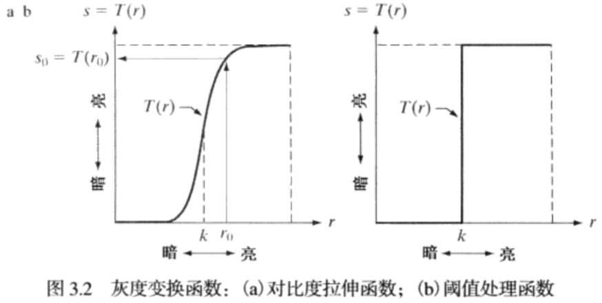
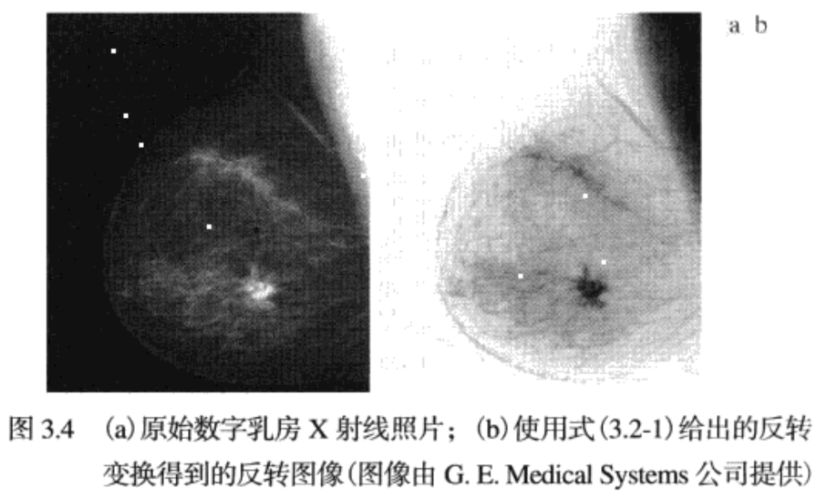
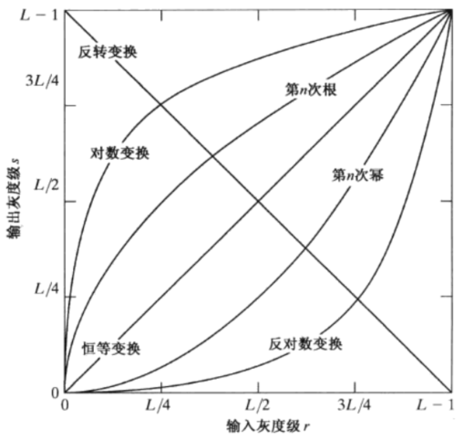
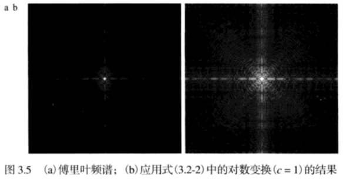
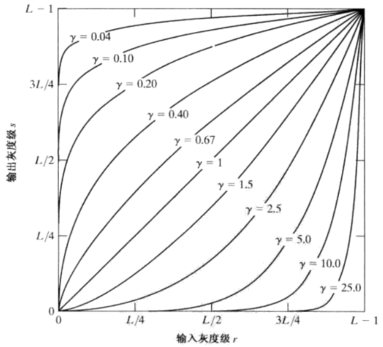
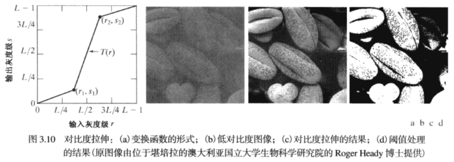
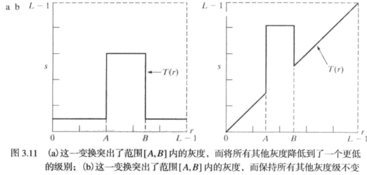
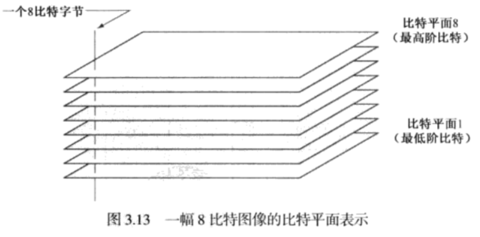
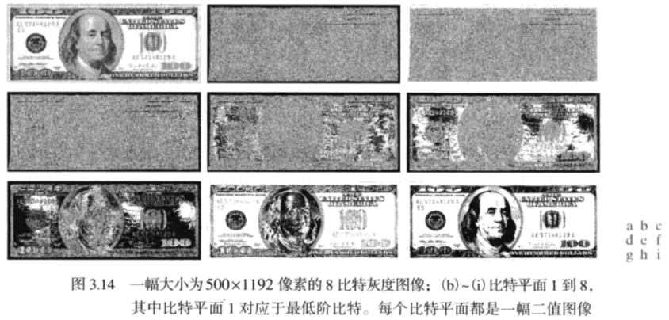

# Chapter3 灰度变换和空间滤波
术语 **空间域**指图像平面本身，这类图像处理方法是直接以图像中的像素操作为基础。这是相对于 **变换域**中的图像处理而言的。

## 3.1 灰度变换和空间滤波基础
本节的空间域处理可由下式表示：
$$
g(x)  = T[f(x,y)]
$$
其中，$f(x,y)$是输入图像，$g(x,y)$是处理后的图像，T是在点$(x,y)$的邻域上定义的关于f的一种算子。
灰度变换函数：
$$
s = T(r)
$$
为了表达方便，令$r$和$s$分别表示变量，即g和f在任意点 **$(x,y)$** 处的 **灰度** 。例如，

如果$T(r)$有$3.2(a)$所示的形式，对$f$中每个象素施以变换产生相应的g的象素效果将比原始图像有更高的对比度，**即低于k的灰度级更暗，而高于k的灰度级更亮**，叫做 **对比度拉伸**。极限情况下为 **阈值处理函数**。

## 3.2 一些基本的灰度变换函数
* 图像反转：得到等效的照片底片，适用于增强 **嵌入在一幅图像的暗区域中的白色或灰色细节**。
$$
s=L-1-r
$$

* 对数变换：将输入中范围较窄的低灰度值映射为输出中较宽范围的灰度值。
$$
s=c \log (1+r)
$$
  

对数函数有一个重要的特征：**压缩像素值变化较大的图像的动态范围**。像数值有较大的动态范围的一个典型的应用说明是 **傅里叶频谱**。通常，频谱值得的范围从0到$10^6$,图像的显示系统不能如实再现如此大范围的灰度值。

3.5(a)显示了值域为$0-1.5*10^6$的傅里叶频谱，当这些值在一个8比特系统中被线性地缩放显示时，**最亮的像素将支配该显示**，频谱中的低值(恰恰是重要的)**将损失掉**。如果我们先对频谱值应用对数变换，那么得到的值的范围就为 $0~6.2$，3.5(b)显示了细节。

* 伽马变换
$$
s=c r^{\gamma}
$$

## 3.3 分段线性变换函数
1. 对比度拉伸

2. 灰度级分层

3. 比特平面分层

根据灰度变换函数，显示一幅8比特图像的第8个比特平面并不困难，可用阈值灰度变换函数处理，该函数将 $0-127$之间的灰度映射为0，将 $128-255$灰度映射为1.
将一幅图像分解为 **比特平面**，可以确定用于量化该图像的比特数的充分性。

## 3.4 直方图处理
灰度级范围为$[0,L-1]$的数字图像的直方图是离散函数
$$
h(r_k)=n_k
$$
$r_k$是第k级灰度值，$n_k$是图像中灰度为$r_k$的像素个数。

归一化后的直方图：M,N是图像的行和列的维数。
$$
P(r_k) = \frac{n_k}{MN}
$$
其中，k=0,1...L-1.简单来说，$p(r_k)$是灰度级$r_k$在图像中出现的概率的一个估计。

### 3.4.1 直方图均衡
考虑连续的灰度值，用r表示待处理图像的灰度，假设r的取值区间为$[0,L-1]$,并且 $r=0$为黑，$r=L-1$为白。**灰度映射**：
$$
s=T(r), 0 \leqslant r \leqslant L-1
$$
对输入图像中每个具有r值的像素值产生一个输出灰度值s,我们假设:

a. $T(r)$在区间 $0 \leqslant r \leqslant L-1$上为单调递增函数。保证输出灰度值不少于相应的输入灰度值，防止缺陷。

b. 当 $0 \leqslant r \leqslant L-1$,$0 \leqslant T(r) \leqslant L-1$。保证输出灰度值范围和输入灰度范围相同。

用反函数：
$$
r=T^{-1}(s), 0 \leqslant s \leqslant L-1
$$
a. $T(r)$在区间 $0 \leqslant r \leqslant L-1$上为 **严格单调递增函数**。防止出现二义性。避免两个不同的r对应一个s.当严格单调不满足时，**使用寻找最接近整数匹配的方法来解决非唯一反变换的问题**。

一幅图像的灰度级可看成是区间 $[0,L-1]$内的随机变量。随机变量的基本描绘子是其 **概率密度函数**(PDF).令 $p_r(r)$和$p_s(s)$分别表示随机变量r和s的概率密度函数：
$$
\int_{-\infty}^{+\infty}p_r(r)dr = \int_{-\infty}^{+\infty}p_s(s)ds = 1 
$$
两边同时对s微分：
$$
p_s(s) =p_r(r)|\frac{T^{-1}(s)}{ds}| = p_r(r) |\frac{dr}{ds}|
$$
**直方图均衡化处理**是以 **累积分布函数变换法**为基础的直方图修正法。**假定**变换函数为：
$$
s=T(r)=(L-1) \int_{0}^{r} p_{r}(w) \mathrm{d} w
$$
其中，w是积分的假变量，公式右边是随机变量r的 **累积分布函数**(CDF).因为PDF总是为正，满足 **严格单调条件**。当在该等式中上限是$r = (L-1)$时，则积分值等于1，s的最大值为 (L-1)，满足 **输入输出相同范围条件**。

将 $\frac{dr}{ds}$代入，并且由莱布尼茨变积分微分得到：

$$
\frac{\mathrm{d} s}{\mathrm{d} r}=\frac{\mathrm{d} T(r)}{\mathrm{d} r}=(L-1) \frac{\mathrm{d}}{\mathrm{d} r}\left[\int_{0}^{r} p_{r}(w) \mathrm{d} w\right]=(L-1) p_{r}(r)
$$
将$\frac{dr}{ds}$代入：

$$
p_{s}(s)=p_{r}(r)\left|\frac{\mathrm{d} r}{\mathrm{d} s}\right|=p_{r}(r)\left|\frac{1}{(L-1) p_{r}(r)}\right|=\frac{1}{L-1}, \quad 0 \leqslant s \leqslant L-1
$$

可以看出 $p_s(s)$是一个均匀概率密度函数，

### 3.4.2 直方图匹配
令$p_r(r)$和$p_z(z)$表示它们所对应的连续概率密度函数。r和z分别表示输入图像和输出，我们可以由 **输入图像估计**$p_r(r)$,而 $p_z(z)$是我们希望输出图像所具有的 **指定概率密度函数**。
$$
s=T(r)=(L-1) \int_{0}^{r} p_{r}(w) \mathrm{d} w 
\\
G(z)=(L-1) \int_{0}^{z} p_{z}(t) \mathrm{d} t=s
\\
z=G^{-1}[T(r)]=G^{-1}(s)
$$
如下步骤：
1. 由输入图像得到 $p_r(r)$,并得到s的值。
2. 由指定的PDF求得变换函数 $G(z)$
3. 求得反变换函数 $z = G^{-1}(s)$,得到s到z的映射。

### 3.4.3 在图像增强中使用直方图统计
$r$表示在区间$[0,L-1]$上代表灰度值的一个离散随机变量，并令$p(r_i)$表示对应于$r_i$