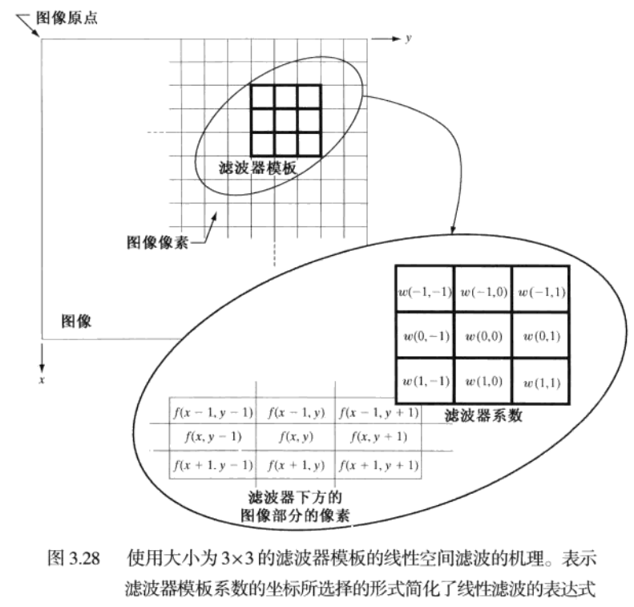
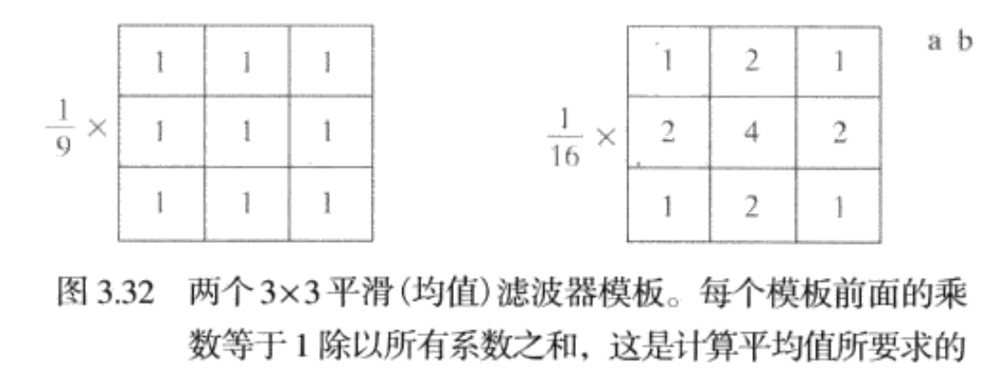

# Chapter3 灰度变换和空间滤波
术语 **空间域**指图像平面本身，这类图像处理方法是直接以图像中的像素操作为基础。这是相对于 **变换域**中的图像处理而言的。

## 3.1 灰度变换和空间滤波基础
本节的空间域处理可由下式表示：
$$
g(x)  = T[f(x,y)]
$$
其中，$f(x,y)$是输入图像，$g(x,y)$是处理后的图像，T是在点$(x,y)$的邻域上定义的关于f的一种算子。
灰度变换函数：
$$
s = T(r)
$$
为了表达方便，令$r$和$s$分别表示变量，即g和f在任意点 **$(x,y)$** 处的 **灰度** 。例如，

如果$T(r)$有$3.2(a)$所示的形式，对$f$中每个象素施以变换产生相应的g的象素效果将比原始图像有更高的对比度，**即低于k的灰度级更暗，而高于k的灰度级更亮**，叫做 **对比度拉伸**。极限情况下为 **阈值处理函数**。

## 3.2 一些基本的灰度变换函数
* 图像反转：得到等效的照片底片，适用于增强 **嵌入在一幅图像的暗区域中的白色或灰色细节**。
$$
s=L-1-r
$$

* 对数变换：将输入中范围较窄的低灰度值映射为输出中较宽范围的灰度值。
$$
s=c \log (1+r)
$$
  

对数函数有一个重要的特征：**压缩像素值变化较大的图像的动态范围**。像数值有较大的动态范围的一个典型的应用说明是 **傅里叶频谱**。通常，频谱值得的范围从0到$10^6$,图像的显示系统不能如实再现如此大范围的灰度值。

3.5(a)显示了值域为$0-1.5*10^6$的傅里叶频谱，当这些值在一个8比特系统中被线性地缩放显示时，**最亮的像素将支配该显示**，频谱中的低值(恰恰是重要的)**将损失掉**。如果我们先对频谱值应用对数变换，那么得到的值的范围就为 $0~6.2$，3.5(b)显示了细节。

* 伽马变换
$$
s=c r^{\gamma}
$$

## 3.3 分段线性变换函数
1. 对比度拉伸

2. 灰度级分层

3. 比特平面分层

根据灰度变换函数，显示一幅8比特图像的第8个比特平面并不困难，可用阈值灰度变换函数处理，该函数将 $0-127$之间的灰度映射为0，将 $128-255$灰度映射为1.
将一幅图像分解为 **比特平面**，可以确定用于量化该图像的比特数的充分性。

## 3.4 直方图处理
灰度级范围为$[0,L-1]$的数字图像的直方图是离散函数
$$
h(r_k)=n_k
$$
$r_k$是第k级灰度值，$n_k$是图像中灰度为$r_k$的像素个数。

归一化后的直方图：M,N是图像的行和列的维数。
$$
P(r_k) = \frac{n_k}{MN}
$$
其中，k=0,1...L-1.简单来说，$p(r_k)$是灰度级$r_k$在图像中出现的概率的一个估计。

### 3.4.1 直方图均衡
考虑连续的灰度值，用r表示待处理图像的灰度，假设r的取值区间为$[0,L-1]$,并且 $r=0$为黑，$r=L-1$为白。**灰度映射**：
$$
s=T(r), 0 \leqslant r \leqslant L-1
$$
对输入图像中每个具有r值的像素值产生一个输出灰度值s,我们假设:

a. $T(r)$在区间 $0 \leqslant r \leqslant L-1$上为单调递增函数。保证输出灰度值不少于相应的输入灰度值，防止缺陷。

b. 当 $0 \leqslant r \leqslant L-1$,$0 \leqslant T(r) \leqslant L-1$。保证输出灰度值范围和输入灰度范围相同。

用反函数：
$$
r=T^{-1}(s), 0 \leqslant s \leqslant L-1
$$
a. $T(r)$在区间 $0 \leqslant r \leqslant L-1$上为 **严格单调递增函数**。防止出现二义性。避免两个不同的r对应一个s.当严格单调不满足时，**使用寻找最接近整数匹配的方法来解决非唯一反变换的问题**。

一幅图像的灰度级可看成是区间 $[0,L-1]$内的随机变量。随机变量的基本描绘子是其 **概率密度函数**(PDF).令 $p_r(r)$和$p_s(s)$分别表示随机变量r和s的概率密度函数：
$$
\int_{-\infty}^{+\infty}p_r(r)dr = \int_{-\infty}^{+\infty}p_s(s)ds = 1 
$$
两边同时对s微分：
$$
p_s(s) =p_r(r)|\frac{T^{-1}(s)}{ds}| = p_r(r) |\frac{dr}{ds}|
$$
**直方图均衡化处理**是以 **累积分布函数变换法**为基础的直方图修正法。**假定**变换函数为：
$$
s=T(r)=(L-1) \int_{0}^{r} p_{r}(w) \mathrm{d} w
$$
其中，w是积分的假变量，公式右边是随机变量r的 **累积分布函数**(CDF).因为PDF总是为正，满足 **严格单调条件**。当在该等式中上限是$r = (L-1)$时，则积分值等于1，s的最大值为 (L-1)，满足 **输入输出相同范围条件**。

将 $\frac{dr}{ds}$代入，并且由莱布尼茨变积分微分得到：

$$
\frac{\mathrm{d} s}{\mathrm{d} r}=\frac{\mathrm{d} T(r)}{\mathrm{d} r}=(L-1) \frac{\mathrm{d}}{\mathrm{d} r}\left[\int_{0}^{r} p_{r}(w) \mathrm{d} w\right]=(L-1) p_{r}(r)
$$
将$\frac{dr}{ds}$代入：

$$
p_{s}(s)=p_{r}(r)\left|\frac{\mathrm{d} r}{\mathrm{d} s}\right|=p_{r}(r)\left|\frac{1}{(L-1) p_{r}(r)}\right|=\frac{1}{L-1}, \quad 0 \leqslant s \leqslant L-1
$$

可以看出 $p_s(s)$是一个均匀概率密度函数，

### 3.4.2 直方图匹配
令$p_r(r)$和$p_z(z)$表示它们所对应的连续概率密度函数。r和z分别表示输入图像和输出，我们可以由 **输入图像估计**$p_r(r)$,而 $p_z(z)$是我们希望输出图像所具有的 **指定概率密度函数**。
$$
s=T(r)=(L-1) \int_{0}^{r} p_{r}(w) \mathrm{d} w 
\\
G(z)=(L-1) \int_{0}^{z} p_{z}(t) \mathrm{d} t=s
\\
z=G^{-1}[T(r)]=G^{-1}(s)
$$
如下步骤：
1. 由输入图像得到 $p_r(r)$,并得到s的值。
2. 由指定的PDF求得变换函数 $G(z)$
3. 求得反变换函数 $z = G^{-1}(s)$,得到s到z的映射。

### 3.4.3 在图像增强中使用直方图统计
$r$表示在区间$[0,L-1]$上代表 **灰度值** 的一个离散随机变量，并令$p(r_i)$表示对应于$r_i$值得归一化直方图分量。我们将 $p(r_i)$看成是灰度$r_i$出现的 **概率**的估计。
$r$关于其均值的n阶矩定义为：
$$
\mu_{n}(r)=\sum_{i=0}^{L-1}\left(r_{i}-m\right)^{n} p\left(r_{i}\right)
$$
其中，m是r的均值(平均灰度，即图像中像素的平均灰度)：
$$
m=\sum_{i=0}^{L-1} r_{i} p\left(r_{i}\right)
$$
**二阶矩** 特别重要：
$$
\mu_{2}(r)=\sum_{i=0}^{L-1}\left(r_{i}-m\right)^{2} p\left(r_{i}\right)
$$
我们将该表达式称为 **灰度方差**。 通常用 $\sigma^{2}$。**均值** 是 **平均灰度** 的度量，方差是 **图像对比度**的度量。
在仅仅处理均值和方差时，实际上通常从 取样值来估计它们， 而不必计算直方图，近似地，这些估计称为 **取样均值** 和 **取样方差**。
$$
m=\frac{1}{M N} \sum_{x=0}^{M-1} \sum_{y=0}^{N-1} f(x, y)
$$
和
$$
\sigma^{2}=\frac{1}{M N} \sum_{x=0}^{M-1} \sum_{y=0}^{N-1}[f(x, y)-m]^{2}
$$
全局均值和方差是在 **整幅图像** 上计算的，这对于 **全面灰度和** 对比度的总体调整是有用的，这些参数的一种更强有力的作用是 **局部增强**，在局部增强中，局部均值和方差是根据图像中每一像素的领域内的图像特征进行改变的基础。
令$(x,y)$表示给定图像中任意像素的坐标，$S_{xy}$表示规定大小的以$(x,y)$为中心的邻域。邻域中像素的 **均值** 为：
$$
m_{S_{x y}}=\sum_{i=0}^{L-1} r_{i} p_{S_{x y}}\left(r_{i}\right)
$$
**方差** 为：
$$
\sigma_{S_{m}}^{2}=\sum_{i=0}^{L-1}\left(r_{i}-m_{S_{p}}\right)^{2} p_{S_{p}}\left(r_{i}\right)
$$

* 使用直方图统计的 **局部增强**

问题是 **增强暗色区域**，但同时尽可能保留明亮区域不变，因为明亮区域不需要增强。我们可以使用本节介绍的概念来阐明一种增强方法，这种方法能分辨 **暗色区域** 与 **明亮区域** 的 **不同**。判断一个区域在点 $(x,y)$ 是暗色还是明： 将局部平均灰度 $m_{S_{xy}}$与 表示为 $m_G$并成为 全局均值的平均图像uhi都进行比较。如果 $m_{s_{\mathrm{p}}} \leqslant k_{0} m_{G}$， 其中 $k_0$ 是一个值小于1.0的正常数，那么我们将点 $(x,y)$ 处像素考虑为处理的候选点。

同理增强 **低对比度**区域，$\sigma_{s_{p}} \leqslant k_{2} \sigma_{G}$。

最后，我们需要限制能接受的最低的对比度值，否则 **该过程会试图增强标准差为零的恒定区域**。$k_{1} \sigma_{G} \leqslant \sigma_{S_{m}}, k_{1}<k_{2}$

## 3.5 空间滤波基础
**滤波** 一词借用于 **频域处理**，**低通滤波器**是通过低频。低通滤波器的最终效果是 模糊(平滑)一幅图像。事实上，**线性空间滤波** 与 频率域滤波之间存在一一对应的关系。然而，空间滤波还可用于 **非线性滤波**，而这在 **频率域** 中是做不到的。

### 3.5.1 空间滤波机理
滤波器的响应 $g(x,y)$是滤波器系数与由该滤波器包围的图像像素的乘积之和：
$$
g(x, y)=w(-1,-1) f(x-1, y-1)+w(-1,0) f(x-1, y)+\cdots+
\\
w(0,0) f(x, y)+\cdots+w(1,1) f(x+1, y+1)
$$
一般来说，使用大小为 $m * n$的滤波器对大小为 M x N的图像进行 **线性空间滤波**，可由下式表示：
$$
g(x, y)=\sum_{s=-a}^{a} \sum_{t=-b}^{b} w(s, t) f(x+s, y+t)
$$

### 3.5.2 空间相关与卷积
**相关** 是滤波器模板移过图像并计算位置乘积之和的处理。**卷积**的机理相似，但滤波器首先要 **旋转180**.
**相关**： 我们将包含单个1而其余都是0的函数称为 **离散单位冲激**。一个函数与 **离散单位冲激相关**，在该冲激位置产生这个函数的一个翻转的版本。
$$
w(x, y) ☆ f(x, y)=\sum_{s=-a}^{a} \sum_{t=-b}^{b} w(s, t) f(x+s, y+t)
$$
**卷积**： 某个函数与某个单位冲激卷积，得到一个在该冲激函数处的这个函数的 **拷贝**。为了执行卷积，将这个函数旋转180°，然后相关。
$$
w(x, y) ★ f(x, y)=\sum_{s=-a}^{a} \sum_{t=-b}^{b} w(s, t) f(x-s, y-t)
$$

## 3.5.3 空间滤波器模板的产生
生成一个大小为 m x n的线性空间滤波器要求指定 mn 个模板系数，这些系数是根据该滤波器支持什么样的操作来选择的。记住，我们使用 **线性滤波器** 所能做的所有事情是实现 **乘积求和操作**。

## 3.6 平滑空间滤波器
平滑滤波器用于 **模糊处理**和 **降低噪声**。模糊处理经常用于预处理任务中，例如在大目标提取之前可以去除图像中的一些琐碎细节，以及桥接直线或者曲线的缝隙，通过线性滤波和非线性滤波模糊处理，可以降低噪声。

### 3.6.1 平滑线性滤波器
平滑线性空间滤波器的输出(响应)是包含在 **滤波器模板领域内的像素的简单的平均值**。这些滤波器也称之为 **均值滤波器**，**低通滤波器**。
平滑滤波器处理降低了图像灰度的“尖锐”变化。由于典型的随机噪声由灰度级的急剧变化组成，因此， 常见的平滑处理应用就是 **降低噪声**。然而，由于 **图像边缘**也是由图像灰度尖锐变化带来的特性，所以均值滤波会造成 **边缘模糊** 的 **负面效应**。

第二个卷积模板，**赋予中心点最高权重**，然后随着距中心距离的增加而减小系数值得加权策略的目的是在 **平滑处理** 中 试图 **降低模糊**。
一个M x N 的图像经过一个大小为 m x n 的加均均值滤波器滤波的过程由下式给出：
$$
g(x, y)=\frac{\sum_{s=-a}^{a} \sum_{t=-b}^{b} w(s, t) f(x+s, y+t)}{\sum_{s=-a}^{a} \sum_{t=-b}^{b} w(s, t)}
$$

使用平滑滤波，较小的物体的灰度与背景混合在一起，较大的物体变得像斑点，使用模糊图像的最高亮度25%的阈值，可以得到感兴趣的物体。

## 3.7 统计排序(非线性)滤波器
**中值滤波器**对一定类型的随机噪声，包括 **椒盐噪声**，**脉冲噪声**。提供优秀的去噪能力，并且比同尺寸的线性平滑滤波器的模糊程度要明显低。

## 3.8 锐化空间滤波器
**锐化处理**的主要目的事 **突出灰度的过度部分**，**图像微分**增强边缘和其他突变，而削弱灰度变化缓慢的区域。

### 3.8.1 基础
